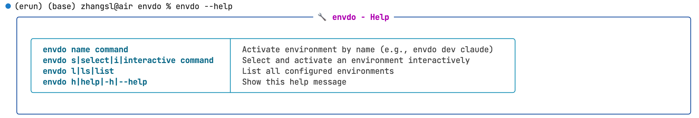
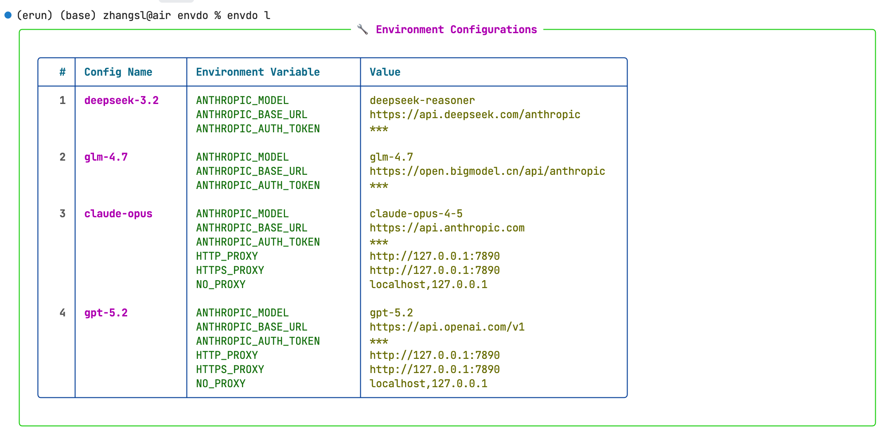
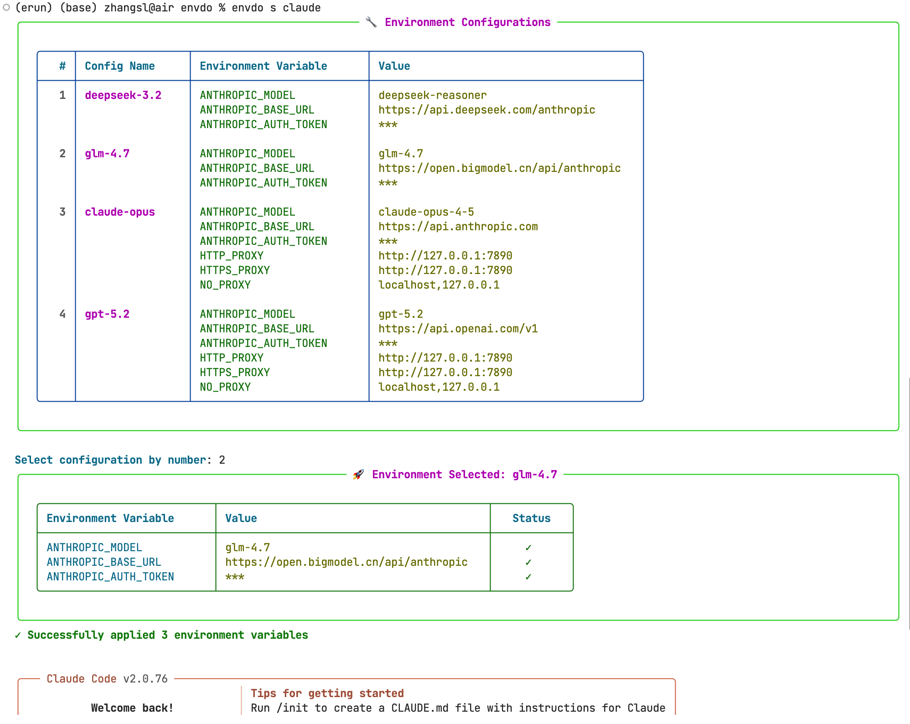
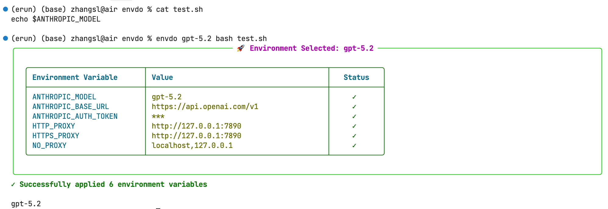

# envdo

[](https://badge.fury.io/py/envdo)
[](https://www.python.org/downloads/)
[](LICENSE)
[](https://github.com/NewToolAI/envdo)

\[ 中文 | [English](README.md) \]

为 Python 代码或命令行程序配置环境变量，提供基于组切换的 dotenv 管理功能。

## 功能特性

- **组环境变量配置** - 为程序配置一组环境变量，不影响系统环境
- **多环境管理** - 支持配置多个环境，方便快速切换
- **敏感信息保护** - 自动隐藏敏感信息（TOKEN、KEY、PASSWORD 等）
- **交互式选择** - 支持交互式选择环境配置
- **清晰输出** - 使用 rich 库提供清晰的终端输出

## 安装

```bash
pip install envdo
```

```bash
pip install git+https://github.com/NewToolAI/envdo.git
```

## 配置

创建配置文件 `.envdo.json`（项目目录）或 `~/.envdo.json`（用户目录）：

```json
{
    "deepseek-3.2": {
        "ANTHROPIC_MODEL": "deepseek-reasoner",
        "ANTHROPIC_BASE_URL": "https://api.deepseek.com/anthropic",
        "ANTHROPIC_AUTH_TOKEN": "your-token-here"
    },
    "glm-4.7": {
        "ANTHROPIC_MODEL": "glm-4.7",
        "ANTHROPIC_BASE_URL": "https://open.bigmodel.cn/api/anthropic",
        "ANTHROPIC_AUTH_TOKEN": "your-token-here"
    },
    "claude-opus": {
        "ANTHROPIC_MODEL": "claude-opus-4-5",
        "ANTHROPIC_BASE_URL": "https://api.anthropic.com",
        "ANTHROPIC_AUTH_TOKEN": "your-token-here",
        "HTTP_PROXY": "http://127.0.0.1:7890",
        "HTTPS_PROXY": "http://127.0.0.1:7890",
        "NO_PROXY": "localhost,127.0.0.1"
    }
}
```

## 代码使用方法

```python
from envdo import load_envdo

load_envdo('example-1')
```

## 命令使用方法



### 列出所有环境配置

```bash
envdo list
```



### 交互式选择环境

```bash
envdo select <command>
```



### 使用指定环境运行命令

```bash
envdo gpt-5.2 <command>
```



### 编辑配置文件

```bash
envdo e
envdo edit
```

在编辑器中打开当前正在使用的 `.envdo.json`（优先项目目录，其次 `~/.envdo.json`）。编辑器按 `$VISUAL` / `$EDITOR` 解析（两者都支持 `code --wait` 这类带参数写法），未设置时回退到 `vi`。即使当前 JSON 已损坏，`envdo e` 也能打开文件以便修复；编辑器关闭后会校验 JSON 格式。

### 其他命令

```bash
envdo -v          # 显示版本
envdo --version
envdo -h          # 显示帮助
envdo --help
envdo e           # 编辑当前正在使用的 .envdo.json 文件
envdo edit
```

## 配置说明

- 配置文件优先级：当前目录的 `.envdo.json` > 用户目录的 `~/.envdo.json`
- 首次运行时，如果配置文件不存在，会自动创建示例配置文件
- 敏感信息（包含 TOKEN、KEY、PASSWORD、SECRET、AUTH、CREDENTIAL 等关键词）会自动显示为 `***`
- `envdo e` 的编辑器优先级：`$VISUAL` > `$EDITOR` > `vi`

## 许可证

MIT License
